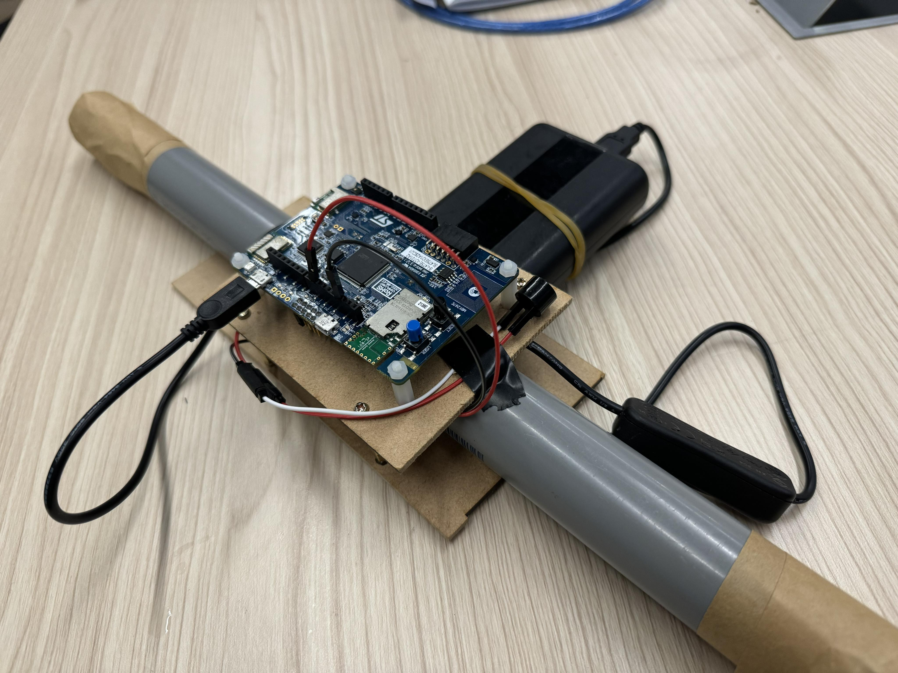

# Report

This is the report of the eslab final project.

Group: 3\
Members: B10901027楊竣凱、B10901059林咏毅、B10502139許禎勻

## Description

This project is a game developed using the STM32 IoT Node and web interactions. It aims to implement game functionalities through actual hardware controls and web interactions.

## Motivaiton

- Design a PC game with peripheral game pad.
Videos on YT looks cool
- Try using STM32 to realize the function of a game pad
- We love playing games!

## Method

- STM32 IoT node

  - BLE connection
    - Sensor Service
    - Notify Characteristic - Read BSP Sensor value.
    - Writable Characteristic - Accept the signal from web and make reaction, i.e. `collision response`.
  - DMA programming - Low Pass Filter
  - PWM wave - Send different signals to the vibration motor.
- Web
  - file structure
  
  - BLE connection
    - Apply the React BLE API to achieve the BLE connection between website and STM32.
    - Writable Characteristic - Accept signal from STM32 to make corresponding response, i.e. `moving`, and `startup` the game.
    - Send signal back to STM32 when collision happens to trigger the buzzer on STM32.
  - React Programming
    - Game page - Start page, Game page, and Gameover page
    - Game component - In `./web/src/component`. Define game object.
    - BLE function & Variable - In `./web/src/hooks`. Implement BLE API and declare variables used to control the game status.
    - Game animation - In `./web/src/style`.  Written in css to design the Game display and animation.
- Joystick
  - Usage - For user to control the spaceship to dodge the meteorite by tilting the device.
  - Function
    - The more the device tilted, the faster can the player move.
    - When collision happens, the buzzer connected will notify the user.
  - Design
  

## Result

- Build project
- BLE connection with web
- Control
- Animation
- Response

## Reference

- [DIY Bluetooth GamePad for Android, PlayStation and PC.](https://www.youtube.com/watch?v=zOuCZpH0Dqg)
