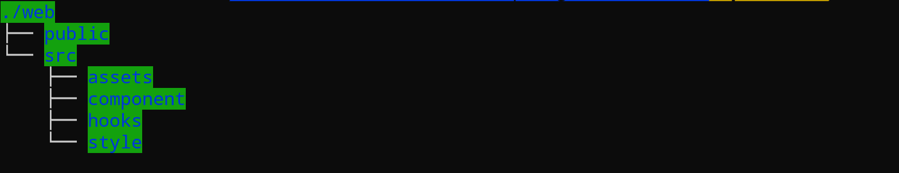
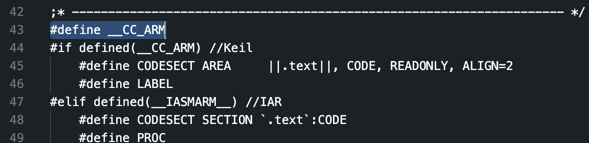
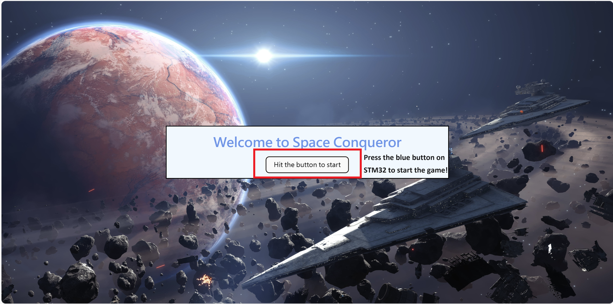
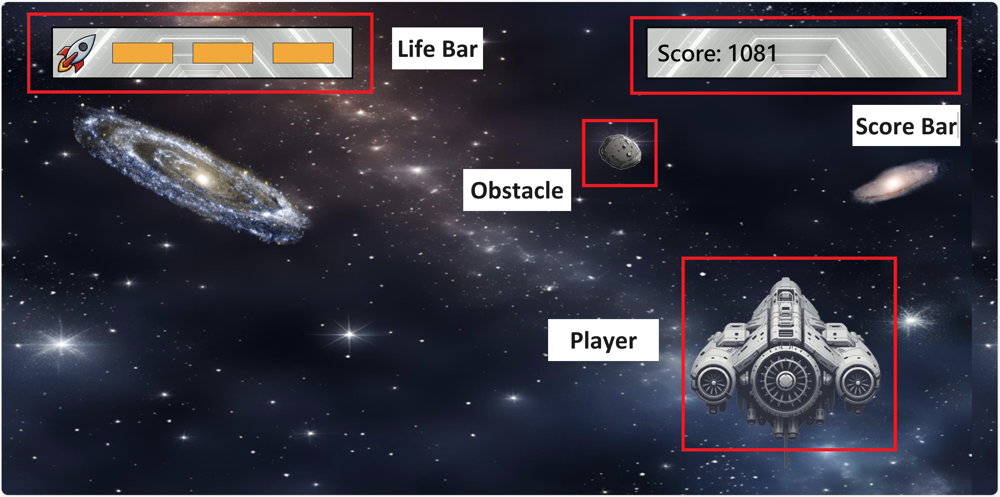

# Report

This is the report of the eslab final project.

Group: 3\
Members: B10901027楊竣凱、B10901059林咏毅、B10502139許禎勻

## Description

This project is a game developed using the STM32 IoT Node and web interactions. It aims to implement game functionalities through actual hardware controls and web interactions.

## Motivaiton

Our project aims to design a PC game with a custom peripheral game pad, inspired by a gaming video on YouTube. We use STM32 to create a responsive and intuitive game pad. This allows us to combine our technical skills with our passion for gaming, enhancing the overall gameplay experience. By integrating a custom-built game pad, we can create a unique and engaging game tailored to our preferences.

## Technology

- ***STM32 IoT node***

  - **BLE connection**
    - Customize Service and UUIDs
    - Notify Characteristic
    - Writable Characteristic - Accept the signal from web and make reaction, i.e. `collision response`.
  - **DMA programming** - Low Pass Filter for Accelero values.
  - **PWM wave** - Send signals to the beeper with 100Hz wave every 50ms for 10 times.
  
  - **Event Loop** - make multi-thread atomic and safe to collect, process, send and receive data. 
  - **Circular buffer** - store the data read from sensor onboard.
  - **Data Acquisition** - read BSP sensor and send to buffer.
  
- ***Web***
  - **file structure**
  
  - **BLE connection**
    - Apply the React BLE API to achieve the BLE connection between website and STM32.
    - Writable Characteristic - Accept signal from STM32 to make corresponding response, i.e. `moving`, and `startup` the game.
    - Send signal back to STM32 when collision happens to trigger the buzzer on STM32.
  - **React Programming**
    - Game page - Start page, Game page, and Gameover page
    - Game component - In `./web/src/component`. Define game object.
    - BLE function & Variable - In `./web/src/hooks`. Implement BLE API and declare variables used to control the game status.
    - Game animation - In `./web/src/style`.  Written in css to design the Game display and animation.
- ***Joystick***
  - **Usage** - For user to control the spaceship to dodge the meteorite by tilting the device.
  - **Function**
    - The more the device tilted, the faster can the player move.
    - When collision happens, the buzzer connected will notify the user.
  - **Design**
  
## Method

We seperate the whole system to two parts, web game and STM32 controller. We use BLE to communicate between devices.

On STM32, we use event loop to control the execution of 3 task
1. Collect sensors data every 1ms.
2. Transmit pre-processed data every 50ms. 
   1. Before transmission, we filter and transform the stored data to roll-pitch-yaw, using Accelero and Megnato. Calculate the number to a single int, indicating the speed and direction of the space ship, before send to website.
3. Receive command from website, using interrupt input. Trigger the beeper to alert.

On website side, our spaceship travels through the universe, constantly facing meteor attacks. By receiving data from the STM32, we control the spaceship to dodge along a 1D line. When hit by a meteor, a command is sent to the STM32 to trigger a warning sound.

## Installation of STM32

Follow these steps to install the project:

1. Clone the project:

   ```bash
   git clone https://github.com/lin-1214/2024Spring_ESLAB_Final.git

2. Open the project with Mbed Studio.
3. Fix the required libraries:\
   
4. Open `mbed-dsp/cmsis_dsp/TransformFunctions/arm_bitreversal2.S` and add `#define __CC_ARM` on line 43
   
5. Set the target hardware to ***DISCO-L475VG-IOT01A or B-L475E-IOT01A****.
6. Build the project and run.

## Web

1. Clone the project:

   ```bash
   git clone https://github.com/lin-1214/2024Spring_ESLAB_Final.git

2. Go to the web directory

   ```
   cd ./web
3. Install the packages

   ```
   pnpm install
4. Run up the website

   ```
   pnpm vite
5. Connect STM32 by BLE and enjoy the game  

## BLE Connection

1. Set up the web browser and STM32 following the steps mentioned above.
2. Press the button to start finding BLE device
   ![image]./img/img04.png)

3. Once the STM32 connected, you can start the game!

## How to play
1. Press the blue button on STM32 to start the game


2. Gaming display


2. Try your best to dodge the meteorite and get a higher score!

3. Once your life become 0, the game is over, and you can press the blue button on STM32 to start over again.

## Result

- Build project
- BLE connection with web
- Control
- Animation
- Response
- [Demo Video](https://drive.google.com/file/d/1MnjLGypI6-sU0xRZzgUswl1qq9AR_XP6/view?usp=sharing)

## Problem We Met

- Vibrate motor not working - use a beeper to replace it.
- Sensor Value not too accurate - apply a filter to make it more stable.
- Writable characteristic not working originally - refer to the Mbed BLE example to figure out the problem.

## Future Work

- With more control part.
- Game in more dimension.
- Optimal animation.
- More entertainment.
- More precise control signal.

## Reference

- [DIY Bluetooth GamePad for Android, PlayStation and PC.](https://www.youtube.com/watch?v=zOuCZpH0Dqg)
- [Mbed-os-example-ble](https://github.com/ARMmbed/mbed-os-example-ble/tree/development)
